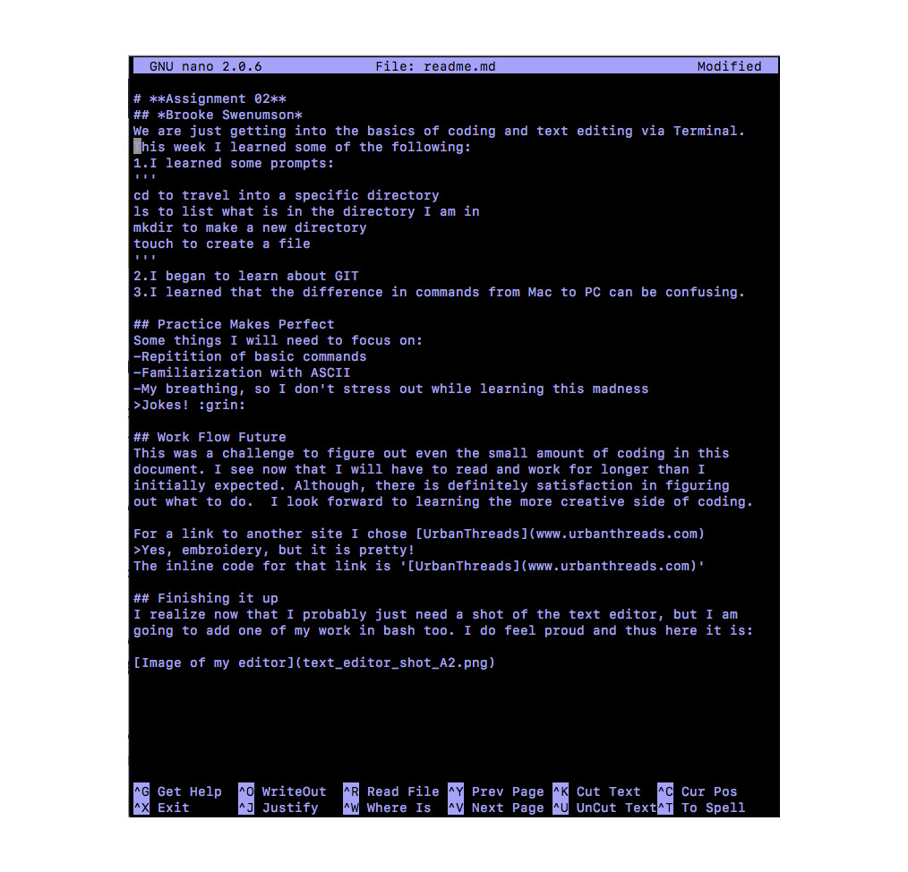
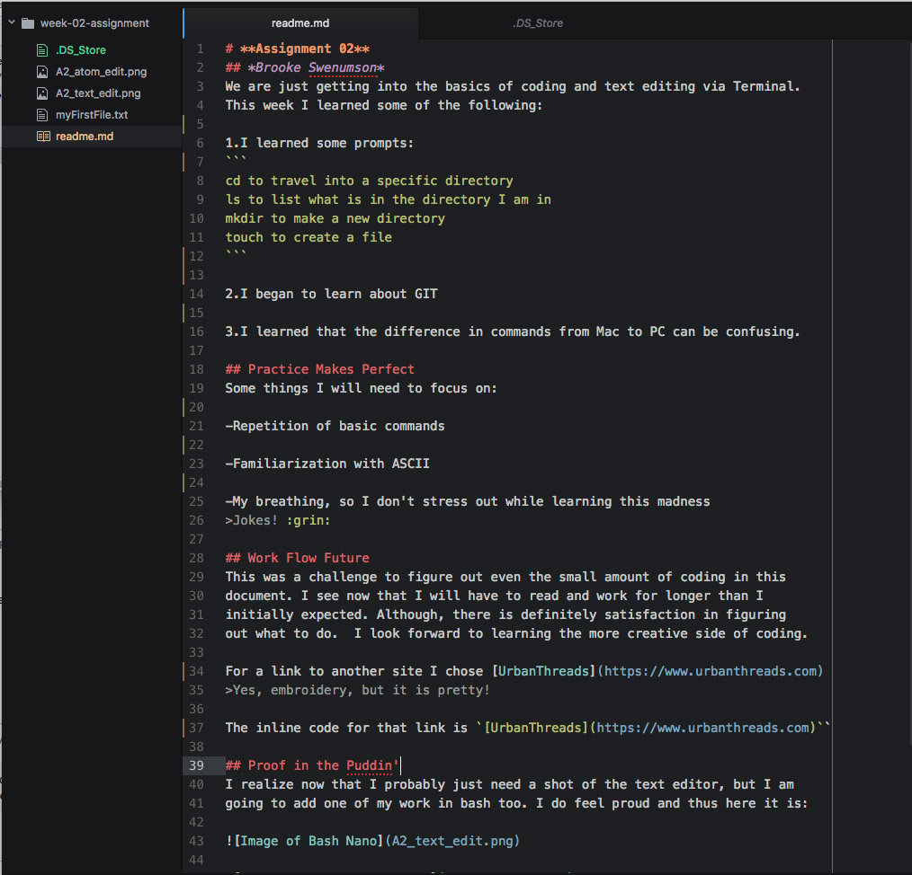

# **Assignment 02**
## *Brooke Swenumson*
We are just getting into the basics of coding and text editing via Terminal.
This week I learned some of the following:

1.I learned some prompts:
```
cd to travel into a specific directory
ls to list what is in the directory I am in
mkdir to make a new directory
touch to create a file
```

2.I began to learn about GIT

3.I learned that the difference in commands from Mac to PC can be confusing.

## Practice Makes Perfect
Some things I will need to focus on:

-Repetition of basic commands

-Familiarization with ASCII

-My breathing, so I don't stress out while learning this madness
>Jokes! :grin:

## Work Flow Future
This was a challenge to figure out even the small amount of coding in this
document. I see now that I will have to read and work for longer than I
initially expected. Although, there is definitely satisfaction in figuring
out what to do.  I look forward to learning the more creative side of coding.

For a link to another site I chose [UrbanThreads](https://www.urbanthreads.com)
>Yes, embroidery, but it is pretty!

The inline code for that link is `[UrbanThreads](https://www.urbanthreads.com)``

## Proof in the Puddin'
I realize now that I probably just need a shot of the text editor, but I am
going to add one of my work in bash too. I do feel proud and thus here it is:





*edit-I cannot for the life of me figure out this image embed...I will
hopefully solve this problem tomorrow in class!*

## That's a Wrap
Hopefully I have this all figured right and am turning in the right thing.  
If not, I will try again! :smile: To me this is like an intricate puzzle,
how will it all fit together? Will it work right? I imagine once I know more
it will become quite fun.
