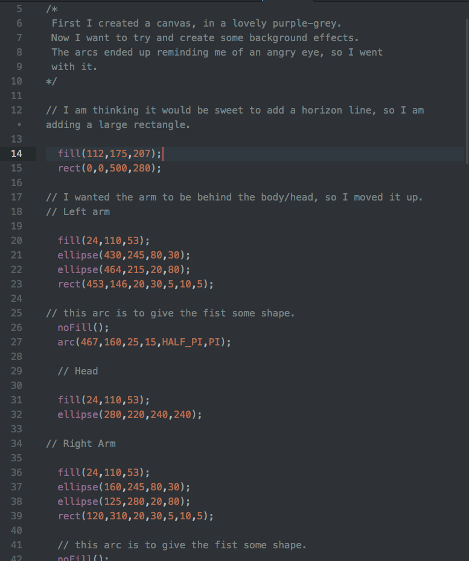

# HW-3:  *Monsta'!*
### Brooke Swenumson

This week our homework was to make a self portrait, monster or character. I ~obviously~ decided to make a monster.  I started by creating my canvas.  I thought to start by trying to create some background, or just make some shapes I hadn't before.

## Site URL

https://bswenumson.github.io/191-work/HW-3/

The above is a link to my Grump Monsta.  It will take you to my personal Git Hub site!

## Begining
I started with an arc. It sounded intriguing, and ended up being the hardest thing to make.  I saw the potential to make a great eye though, so I worked on it until I had what I wanted.

### First Problem

After I made this rad eye I wanted to make it's pair. However I COULD NOT figure out how to rotate, flip or create the right angle for my other eye.  This was very frustrating.  Luckily we covered this in class, so after Monday I was able to go back and create what I wanted.

### More on the Process.

After I made the eyes I had a general idea of what I wanted. I went back and created the body/head.
I made the mouth next.  It did take me quite a bit of trial and error to achieve what I wanted.

### Second Problem

How do I make a fist?  When I went to make the arms it took me a bit to figure out the arc to add to the 'fist' to create a more 'realistic' look.  After lots of guess work I figured out satisfactory angles and placement.

### Last of the Process

In the end I wanted to create a horizon line to give a sense of my monster, dubbed the 'Grump Monsta', resting on the ground.  Last but not least I wanted to give a spikey mowhawk-ish feature to my monster's head.

## Breakthroughs

Learning the arc was definitely the biggest breakthrough for me. It unlocked a stronger understanding of coding all the different shapes.  I was able to visualize the other shape's dimensions better.

## Results

I enjoyed this project.  It was a challenge to figure out the shapes, but was satisfying to see the completed monster. It ended up being similar to what I imagined, so success!

## Future work

This assignment added to the building blocks of my coding knowledge.  I felt pretty rusty on my geometry skills at the begining, but am starting to become more comfortable again.

## Conclusion

Frustrating, fun, functional. This lesson helped me with my visualization of geometry, understanding of how coding effects the image and how to compose my code to get a desired effect.
