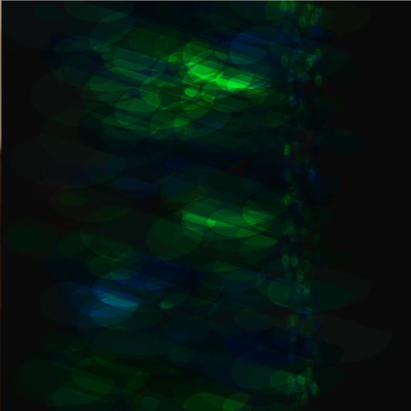

# Random Math
### Brooke Swenumson

This assignment was pretty difficult. I am just barely beginning to grasp and remember the various math functions.  I tried various combinations for about four hours before ending up with my final product.

### Work and Problems

I put these two categories together for this assignment since my work involved me trying new things, seeing what the problem was and trying to figure it out.

### Breakthroughs

I didn't have any full-fledged 'ah-ha!' moments on this assignment, it is a bit muddy for me still.

### Results

I am fairly pleased with my results, just for the fact that it works and looks pretty. However, I had a hard time controlling or fully understanding the process.

### Future work

I know practice is key. The more I work on it the better I will get. And the more tools I will be able to utilize.

