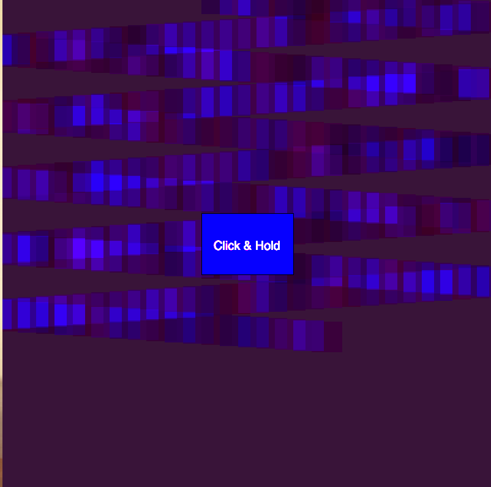
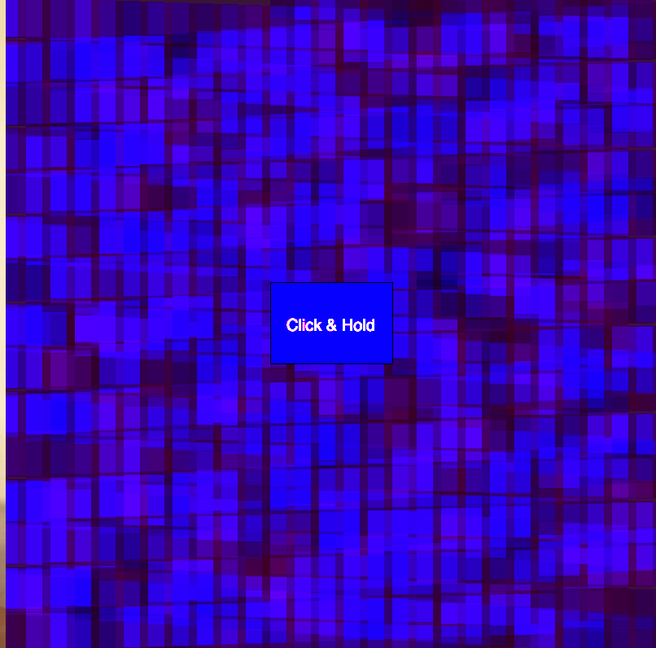

# HW 6: Got GUI?
### Brooke Swenumson

My URL for this week's homework: https://bswenumson.github.io/191-work/Hw-6/

This week's assignment was to create a GUI element that activates an animation.  I chose a button, since that works best in my mind for figuring out right now.

## Process

I started by reviewing the concepts involved by watching the provided videos. These definitely help me understand the underlying concepts.

Next I created a button, then added my animation.

## Problems / Breakthroughs:

For a while my shape wasn't doing what I wanted. I started drastically changing the x value to see a change. When I still received the same results I went back and realized I had the y variable in the x location!

Thus my breakthrough, re-read and re-read the code again if it isn't acting like you expected.

## Results

I was pleased with the result. The only thing I want to learn to do is have the button stay active once it is clicked and pause once it is clicked again.

This homework went a lot smoother than my last homework.  I look forward to the next step.
