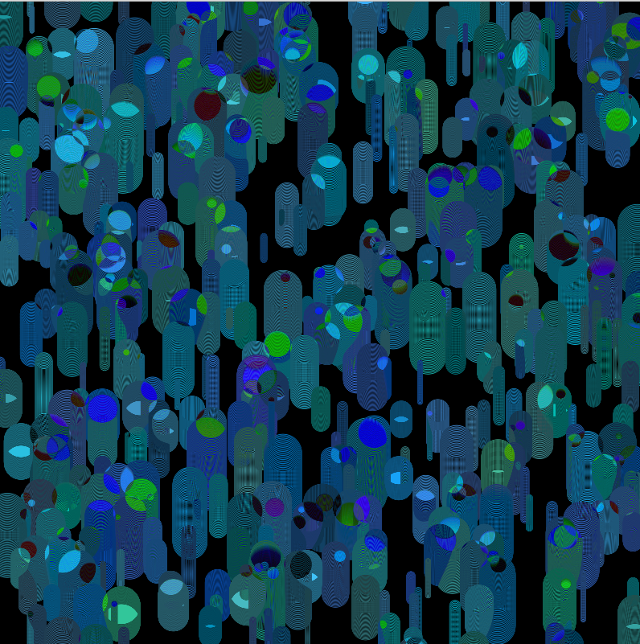
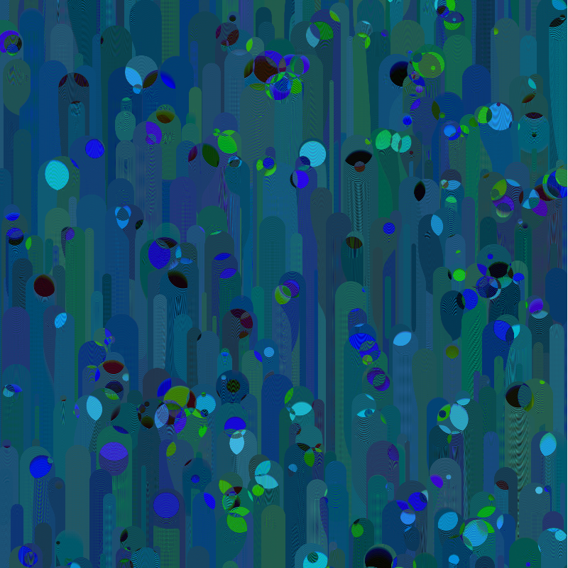

# Hw-8
### Brooke Swenumson

My URL for this week's homework:  https://bswenumson.github.io/191-work/Hw-8/

This week's assignment to create 500 objects with a single class and an array was tough but interesting.

 ## Process

 I started out by reviewing the video links on the homework page. After that I began to create my first object.

 ## Problems / Breakthroughs

 At first I couldn't get the class file to work. After re-reading the instructions I realized I did not have my code lines in order in the html file. After that it worked.

 Another thing is I tried to add a blend mode to my sketch. At first it wasn't working like I hoped, but after a seizure inducing begining with the DIFFERENCE mode, a kinda neat soothing visual is created.

 ## Results

